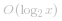

本题中，二分查找的过程可以对应于位运算判断的过程；

例如，对于8位的数：  将 *0* 到*255*划分成了两个区间   即 *[0,127]* 和   即 *[128,255]*；

然后 将*[0,127]*这个区间再次划分为两个区间，依次类推；
 [8bit.png](https://pic.leetcode-cn.com/e718fc720a0df6d87341ef58439f8469bbb35f8ef4809e13ab23536bc82f4c3b-8bit.png)


1. 那么我们先将这些数找到，这是很容易的；通过移位运算就可以实现，这里我们需要循环，所以有如下代码：

    `for (int i = 1 << 15; i != 0; i >>>= 1)`

    注意右移时使用**逻辑右移**(0填充移动后前面的部分)而非算术右移(即用原最高位填充前面部分)

2. 由于我们实现的过程是按位依次划分，所以可以用 `按位或` 运算代替传统的加法运算：

    ` y |= i;`

3. 这个时候如果结果小于实际答案，继续循环，查找靠右的区间；

    如果结果大于实际答案，就需要将刚才更新为1的位置为*0*，

    这里也有一个小技巧，通过 `异或`运算实现，`0000...1...0000 ^ x`相当于对x的指定位取反，如下例：
 [yihuo.png](https://pic.leetcode-cn.com/77478dda2c684fb33837112bdf84f2e64253000240eae7d85f96716cec22a838-yihuo.png)


4. 最后也不要忘了极端情况下的溢出问题:

    `if (y * y < 0 || y * y > x) {y ^= i;}`

    

这样就实现了一个位运算模拟二分查找的过程：

```java
class Solution {
    public int mySqrt(int x) {
        int y = 0;
        for (int i = 1 << 15; i != 0; i >>>= 1) {
            y |= i;
            if (y * y < 0 || y * y > x) {
                y ^= i;
            }
        }
        return y;
    }
}
```


- 时间复杂度  
- 空间复杂度 *O(1)* 

